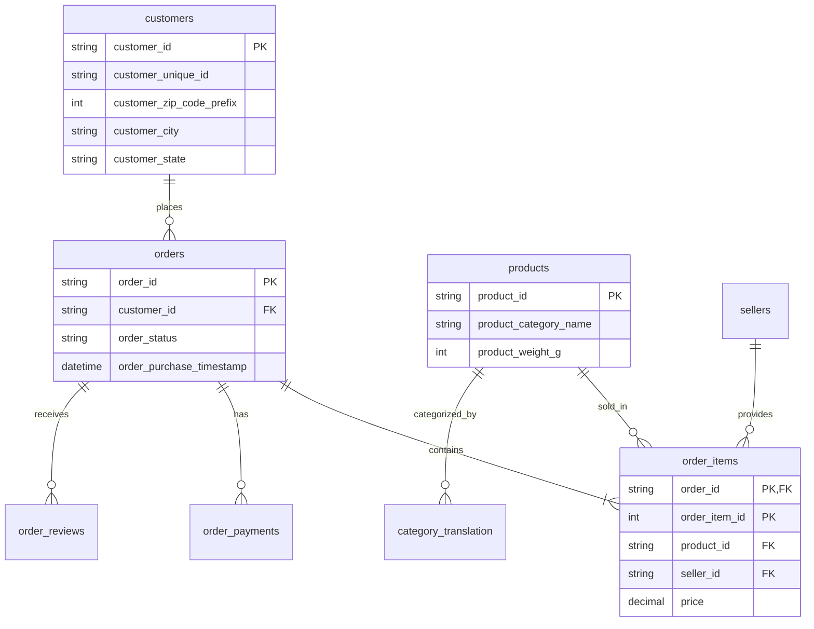

# 📊 E-commerce Data Insights & Visualization

Welcome to the **E-commerce Data Insights** project! This repository contains a robust pipeline for loading, managing, and analyzing e-commerce data from the [Olist Dataset](https://www.kaggle.com/datasets/olistbr/brazilian-ecommerce). 

Transform raw CSV data into a structured MySQL database and unlock deep retail insights with ease.

---

## 🚀 Key Features

- **Automated Data Pipeline**: Seamlessly load multiple CSV datasets into MySQL using Python and SQLAlchemy.
- **Simplified Data Management**: Cleaned and simplified filenames for better developer experience.
- **Optimized Schema**: Well-structured database schema with foreign key constraints for data integrity.
- **Scalable Loading**: Chunk-based processing to handle large datasets without memory exhaustion.

---

## 🛠️ Technology Stack

| Component | Technology |
| :--- | :--- |
| **Database** | MySQL 8.0+ |
| **Language** | Python 3.12+ |
| **Libraries** | Pandas, SQLAlchemy, PyMySQL |
| **Notebook** | Jupyter (IPython) |

---

## 🏗️ Database Architecture

The project uses a relational schema designed to represent a complex e-commerce ecosystem.



---

## 📥 Setup & Installation

### 1. Database Initialization
Execute the SQL commands in `database_setup_MYSQL.txt` using MySQL Workbench or your preferred CLI to create the `my_company` database and its tables.

### 2. Configure Credentials
Open `queries_vis.ipynb` and update the configuration cell with your MySQL credentials:
```python
DB_HOST = 'localhost'
DB_USER = 'your_username'
DB_PASSWORD = 'your_password'
DB_NAME = 'my_company'
```

### 3. Load Data
Run the cells in the notebook to automatically process the CSV files in the `small_data/` directory.

---

## 📁 Project Structure

```text
.
├── assets/                     # Design assets and banners
├── small_data/                 # Simplified CSV datasets
│   ├── customers.csv
│   ├── orders.csv
│   ├── products.csv
│   └── ... 
├── database_setup_MYSQL.txt    # Database schema definition
└── queries_vis.ipynb           # Main data loading notebook
```

---

> [!NOTE]
> All CSV files have been renamed to simpler, more intuitive names (e.g., `olist_customers_dataset.csv` → `customers.csv`) to simplify the code and manual queries.
